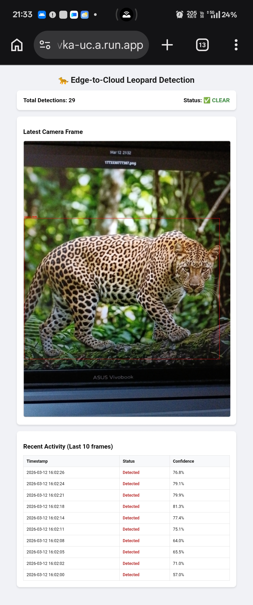
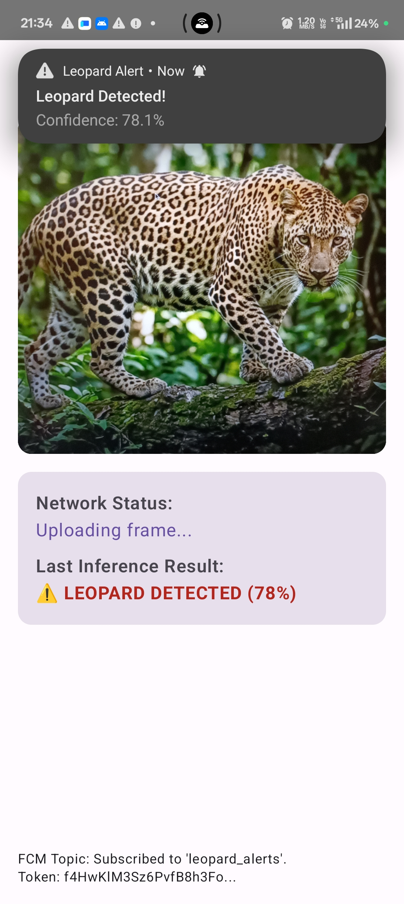

# 🐆 Leopard Detection Alert System

An **AI-powered wildlife monitoring and alert system** that detects leopards using computer vision and triggers alerts through **mobile push notifications and an ESP32 buzzer alarm**.

The system captures images from a phone camera, sends them to a **cloud-hosted AI model**, and generates alerts when a leopard is detected.

This project demonstrates a **complete edge-to-cloud AI pipeline** integrating:

- Deep learning
- Cloud deployment
- Mobile applications
- IoT hardware

## 🎥 Overview
```
Phone Camera → Cloud AI Detection → Firebase Notification → ESP32 Buzzer Alarm
```

## 🧠 System Architecture
```
                 ┌─────────────────────┐
                 │   Android Camera    │
                 │  (Image Capture)    │
                 └──────────┬──────────┘
                            │
                            ▼
                 ┌─────────────────────┐
                 │  Cloud Run Backend  │
                 │ FastAPI + YOLOv8    │
                 │ ONNX Inference      │
                 └──────────┬──────────┘
                            │
        ┌───────────────────┼───────────────────┐
        ▼                   ▼                   ▼
 ┌───────────────┐   ┌───────────────┐   ┌───────────────┐
 │ Web Dashboard │   │ Firebase Push │   │ ESP32 Polling │
 │ Detection Log │   │ Notifications │   │ /alert API    │
 └───────────────┘   └───────────────┘   └───────┬───────┘
                                                 ▼
                                           ┌───────────┐
                                           │  Buzzer   │
                                           │  Alarm    │
                                           └───────────┘
```

## ✨ Features
- 🧠 **AI Leopard Detection** using YOLOv8
- ☁️ **Cloud-based inference** (Google Cloud Run)
- 📱 **Android camera streaming**
- 🔔 **Firebase push notifications**
- 📟 **ESP32 IoT buzzer alarm**
- 🌐 **Live dashboard with detection logs**
- 🔒 **No permanent image storage (privacy friendly)**
- ⚡ **Serverless scalable backend**

<p align="center">
  
  &nbsp;&nbsp;&nbsp;&nbsp;&nbsp;&nbsp;
</p>

## 🛠 Technologies Used
**AI/ML**
- YOLOv8
- PyTorch
- ONNX Runtime
- OpenCV

**Backend**
- FastAPI
- Docker
- Google Cloud Run

**Mobile**
- Kotlin
- Jetpack Compose
- CameraX
- Firebase Cloud Messaging

**IoT**
- ESP32 DevKit V1
- Arduino IDE
- WiFi + HTTPS polling

**Cloud**
- Google Cloud Run
- Artifact Registry
- Secret Manager
- Firebase

## 🧠 Model Training Process
The leopard detection model was trained using **YOLOv8**.

### Dataset
Dataset contains:
- leopard images
- negative images
Structure:
```
dataset/
 ├── images/
 └── labels/
```
Labels follow YOLO format:
```
class x_center y_center width height
```

### Training Command
```python
from ultralytics import YOLO
model = YOLO("yolov8n.pt")
model.train(
    data="data.yaml",
    epochs=50,
    imgsz=640,
    batch=16
)
```

### Export Model
```python
model.export(format="onnx", opset=20)
```
Output:
```
best.onnx
```

## 🌐 Backend API
`/predict`

Upload image for inference.

**Request**
```bash
POST /predict
Content-Type: multipart/form-data
```
Field:
```
file=image
```

**Response**
```json
{
  "detected": true,
  "confidence": 0.94
}
```

`/alert`

Used by ESP32 to check alarm status.

**Response**
```json
{"alert": true}
```
or
```json
{"alert": false}
```

`/dashboard`

Displays:
- last frame
- detection logs
- system status

Auto refresh every few seconds.

## ☁️ Cloud Deployment

Backend is deployed on **Google Cloud Run**.

**Deploy command**
```bash
gcloud run deploy leopard-alert-backend \
  --source . \
  --platform managed \
  --region us-central1 \
  --allow-unauthenticated \
  --memory 2Gi \
  --cpu 1
```

Cloud Run automatically builds the container using Docker.

## 🔐 Firebase Setup

Firebase is used for push notifications.

Steps:
1. Create Firebase project
2. Generate service account JSON
3. Store secret in **Google Secret Manager**
4. Mount secret in Cloud Run

Environment variable:
```
GOOGLE_APPLICATION_CREDENTIALS
```

#### Looking for more detail? Check out [docs/setup_guide.md](https://github.com/pranav-wakode/leopard-alert-system/blob/main/docs/setup_guide.md)

## 📱 Android Application

The Android app performs:
1. Camera capture
2. Image upload to backend
3. Topic subscription
4. Notification display

Topic used:
```
leopard_alerts
```

When backend detects a leopard, a notification is sent to all subscribed devices.

### APK Repository

Android app source code is available here:

[https://github.com/pranav-wakode/leopard-android](https://github.com/pranav-wakode/leopard-android)

## 🤖 ESP32 IoT Alarm

ESP32 polls the backend `/alert` endpoint.

Hardware used:
```
ESP32 DevKit V1
Active Buzzer Module
```

**Wiring**
```
ESP32 GPIO12 → Buzzer Signal
ESP32 3.3V   → Buzzer VCC
ESP32 GND    → Buzzer GND
```

### ESP32 Logic
1. Connect to WiFi
2. Poll backend every few seconds
3. If alert=true
4. Activate buzzer

#### See [Setup Guide](https://github.com/pranav-wakode/leopard-alert-system/blob/main/docs/setup_guide.md) for further details.

## ⚠️ Issues Encountered & Solutions

### Linux Serial Port Permission

Error:
```
Invalid value for '--port'
```

Fix:
```bash
sudo usermod -aG dialout $USER
```

### ESP32 Upload Failure

Error:
```
chip stopped responding
```

Fix:
- reduce upload speed to **115200**
- press **BOOT button during upload**

### Cloud Run Secret Handling

Firebase secret was injected as JSON instead of file path.

Solution:
```
parse JSON from environment variable
initialize firebase with dictionary
```

### HTTP 400 from ESP32

Cause:
```
improper HTTP request formatting
```
Fix:
```
use WiFiClientSecure + HTTPClient
```

## 🚀 Final Result

The system successfully performs:
- real-time leopard detection
- cloud AI inference
- mobile push notifications
- IoT buzzer alarms

This demonstrates a **complete AI + Cloud + IoT pipeline**.

## 📊 Key Highlights
* Real-time AI wildlife detection
* Serverless cloud inference
* Android camera streaming
* Firebase push alerts
* ESP32 hardware alarm
* Privacy-friendly architecture

## 🙌 Acknowledgements
- Ultralytics YOLOv8
- Google Cloud
- Firebase
- Arduino/ESP32 community